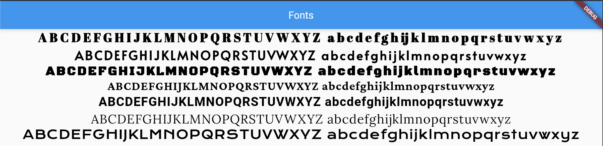

# Fonts Templates for Flutter

First, add google fonts in the pubspec.yaml

    dependencies:
        google_fonts: ^2.1.0

Now it is possible to aggregate new fonts of google to "fonts.dart" and use them according to your requirements.

    Widget strTitleIcon(String strText, Color color, double fontSize, TextAlign textAlign)
    Widget strTitleDialog(String strText, Color color, double fontSize, TextAlign textAlign)
    Widget strTitleLogin(String strText, Color color, double fontSize, TextAlign textAlign) 
    Widget strButtons(String strText, Color color, double fontSize, TextAlign textAlign)
    Widget strTitleTable(String strText, Color color, double fontSize, TextAlign textAlign)
    Widget strContentTable(String strText, Color color, double fontSize, TextAlign textAlign)
    Widget strAdvice(String strText, Color color, double fontSize, TextAlign textAlign)

## Variables

The fonts use the next variables:

    String strText: Text that goes used.
    Color color: Color of the text.
    double fontSize: Size of the text.
    TextAlign textAlign: Specify how to go to align the text.

